## Hi! I'm Hans Elkan Sam C  

Currently a 3rd year Computer Science & Engineering student at **Christ University, Bangalore**. Focused on **Full Stack Development, DevOps and CyberSecurity**

---

## Skills
- Full-Stack Development with **React, Node, Express, SQL, Spring Boot**
- Exploring **DevOps and DevSecOps**: Terraform, Jenkins, AWS automation, Vault, Infrastructure pentesting
- Interested in **CyberSecurity**: Kali Linux, Tor, penetration testing, ethical hacking
- **Other Interests**: Compiler design, system software, encryption, system design

---

## Tech Stack:
                                       

---

### GitHub Metrics

--- 

### More Stats

---

### Additional stats
<!--  -->
 
<!-- -->

---

### Currently Exploring
- Blending CSE and Medical Science
- Contributing to OpenSource
- **DevSecOps**: Building secure applications with end to end security. 
- Mastering **Docker** and **Kubernetes**

---

### A Little About Me
- Always curious, sometimes too deep in thought.  
- I write poetry and lyrics when code isn’t enough.
- Avid chess player. [Lichess](https://lichess.org/@/ZwischenzugX11) (Challenge me anytime)
- Fascinated by philosophy, psychology, and theology.
- Love building projects that blur the line between fun and professional.

---

### Contact Me
  
